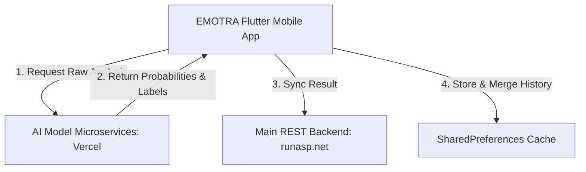

# EMOTRA System Documentation

Welcome to the comprehensive technical documentation for **EMOTRA**, a professional multi-modal emotion detection application built with Flutter.

---

## 1. System Architecture Overview

EMOTRA utilizes a hybrid client-server and microservice architecture to deliver real-time emotion analytics (across Text, Audio, Photo, and Video formats) alongside interactive analytics and history management.



### Key Architectural Concepts:
- **Separation of Concerns**: Machine learning models run on dedicated, scalable microservices. Core user management, alerts, and transaction history are managed by the main API server.
- **Offline & Local-First Resilience**: Analysis histories, active profiles, and notification alerts are backed up locally in `SharedPreferences`. The app seamlessly merges local records with remote cloud synchronizations.
- **Dynamic Styling Core**: System-wide theme notifications dynamically adjust navigation, status bars, and custom cards based on one of five preset UI color schemes.

---

## 2. Directory and File Structure

Below is the directory tree mapping showing where components and files reside in the codebase:

```
lib/
├── main.dart                       # App initializers, theme builders, and System UI layout configuration
├── theme.dart                      # Core colors, theme data properties, text styles, and elevations
│
├── models/
│   └── emotion_result.dart         # EmotionResult parsing models and UserModel structures
│
├── services/
│   ├── api_client.dart             # HTTP REST wrapper handling Bearer authorization, timeouts, and multi-part files
│   ├── auth_service.dart           # Authentication operations, registration, profile updates, and JWT decoder
│   ├── alerts_service.dart         # Alert notification generator, cloud alert sync, and negative streak detector
│   ├── timeline_service.dart       # Local-remote history manager, emotion count calculator, and user streaks
│   ├── text_emotion_service.dart   # Calls Vercel text analysis API and sends transaction to Backend
│   ├── audio_emotion_service.dart  # Formats and uploads raw audio to Vercel and commits to Backend
│   ├── photo_emotion_service.dart  # Runs client-side photo/facial metrics analyzer
│   └── video_emotion_service.dart  # Runs client-side frame-by-frame video segment analyzer
│
├── pages/
│   ├── splash_screen.dart          # Entry animations and auth state verification
│   ├── login_page.dart             # Sign-in UI
│   ├── signup_page.dart            # Sign-up UI
│   ├── forgot_password_page.dart   # Password recovery request screen
│   ├── reset_password_page.dart    # Password reset code form screen
│   ├── home_page.dart              # Multi-tab layout controller (Dashboard, Insights, Profile)
│   ├── alerts_page.dart            # Notification feed screen
│   ├── analysis_workspace_page.dart# Tabbed sub-view launcher for Text, Audio, Photo, and Video workspaces
│   ├── text_emotion_page.dart      # Input form and visual results for Text analysis
│   ├── audio_emotion_page.dart     # Recorder and visual results for Audio analysis
│   ├── photo_emotion_page.dart     # Camera selection and visual results for Photo analysis
│   ├── video_emotion_page.dart      # Video selector and multi-frame segment graphs
│   ├── emotion_dashboard_page.dart # Charts page displaying weekly emotion distribution
│   └── profile_page.dart           # Settings, password updates, theme picker, and account deletions
│
└── widgets/
    ├── emotion_timeline_chart.dart # Interactive bar & pie charts representing weekly scan frequency
    └── shared_widgets.dart         # Common cards, loading placeholders, list tiles, and customized headers
```

---

## 3. Core Services and Implementation Details

### A. Auth Service & JWT Enrichment
The `AuthService` manages endpoints `/auth/login`, `/auth/register`, `/auth/forgot-password`, `/auth/reset-password`, `/user/change-password`, and `/user/account` (deletion).
* **JWT Claims Enrichment**: Since the backend does not expose a profile info endpoint, `AuthService` parses the JSON Web Token (JWT) payload using `base64Url` decoding. It extracts authoritative name fields (such as `firstName`, `lastName`, `GivenName`, `Surname`, or `name`) and updates local profiles:
  ```dart
  final payloadStr = utf8.decode(base64Url.decode(base64Url.normalize(parts[1])));
  final jwtPayload = jsonDecode(payloadStr);
  ```

### B. Timeline Service & Merge Layer
The `TimelineService` manages the persistence and merging of client histories:
* **Deduplication Engine**: Merges remote items from `/analysis/history` with local items by comparing `client_id`, `analysis_id`, and fuzzy-matching matching (`type` + `emotion` within a 5-second interval).
* **Streak Tracking**: Computes daily engagement streaks. It normalizes dates to Cairo timezone (UTC+3) to ensure streaks remain consistent regardless of travel:
  ```dart
  final today = DateTime.now().toUtc().add(const Duration(hours: 3));
  ```

### C. Alerts & Streaks Service
* **Trigger Conditions**: Generates warnings when high negative emotion confidence levels are observed (`angry` > 0.55, `sad` > 0.55), or positive achievements are registered (`happy` > 0.65).
* **Negative Streak Detector**: Evaluates the last 3 items in the history. If all 3 contain consecutive negative emotions (`angry`, `sad`, `fearful`, `disgusted`), it creates a specialized repetition warning alert.

---

## 4. Multi-Modal Emotion Processors

```
   [Input Media]
         │
         ├──► Text  ──► Vercel API (distilroberta-base) ──► probabilities/dominant ──► main backend
         ├──► Audio ──► Vercel API (wav/m4a multipart)  ──► multimodal/dominant     ──► main backend
         ├──► Photo ──► Simulated Client-Side (ML delay)──► local timeline
         └──► Video ──► Simulated Segment Timeline      ──► local timeline
```

### 1. Text Analysis (`TextEmotionService`)
* **AI Service URL**: `https://emotra.vercel.app/text/emotion/text_model`
* **Model**: English DistilRoBERTa-base (weighted sentence intensity).
* **Data Flow**:
  1. Frontend submits a JSON POST request containing `{'text': text}`.
  2. The service extracts probabilities from Vercel's response (`combined_results` or `probabilities`).
  3. The result is synchronized to the main backend at `/api/analysis/text`.

### 2. Audio Analysis (`AudioEmotionService`)
* **AI Service URL**: Configurable via environment variables (defaults to `https://emotra.vercel.app/audio/emotion/audio_model`).
* **Format Requirements**: Multi-part upload with field `file`. Automatically resolves correct audio content types (`audio/wav`, `audio/mp4`, `audio/mpeg`, etc.).
* **Data Flow**:
  1. Raw file uploaded to AI microservice.
  2. Returns multimodal probabilities representing vocal tone and text.
  3. Results are saved to `/api/analysis/audio` on the main backend.

### 3. Photo & Video Analysis (`PhotoEmotionService`, `VideoEmotionService`)
* Currently operate in simulated client-side modes to facilitate seamless demonstrations without requiring dedicated image/video hosting servers.
* **Photo**: Analyzes image hash and file size to generate a unique deterministic set of emotion scores.
* **Video**: Simulates a 5 to 10 segment frame-by-frame analysis with a normalized progress curve showing emotion fluctuations over time.

---

## 5. API Reference & Contract Models

### Text Analysis Model Schema
The model response parses structured outputs as shown below:

```json
{
  "text": "first sentence. second sentence. third sentence",
  "sentences_count": 3,
  "sentences_analysis": [
    {
      "sentence": "first sentence",
      "probabilities": {
        "anger": 0.0305, "disgust": 0.159, "fear": 0.1151, "joy": 0.0064, "neutral": 0.6118, "sadness": 0.0267, "surprise": 0.0505
      },
      "dominant": {
        "label": "neutral",
        "confidence": 0.6118,
        "category": "neutral"
      },
      "intensity_weight": 1
    }
  ],
  "full_text_analysis": {
    "probabilities": { ... },
    "dominant": { ... }
  },
  "combined_final_emotion": {
    "label": "neutral",
    "confidence": 0.7779,
    "confidence_percent": 77.79,
    "category": "neutral"
  },
  "combined_results": [
    {
      "label": "neutral",
      "confidence": 0.7779,
      "confidence_percent": 77.79
    }
  ]
}
```

---

## 6. Theming and Design Systems

The application has five beautifully crafted color options defined in `ThemeColors` to offer a premium, modern user interface.

| Theme Name | Primary Color | Secondary Color | Background Color | Description |
| :--- | :--- | :--- | :--- | :--- |
| **Light** | `#5B5FEF` | `#7C84FF` | `#F6F8FC` | Ultra-clean indigo theme |
| **Dark** | `#7C84FF` | `#22D3EE` | `#0B1020` | High-contrast dark theme |
| **Ocean** | `#0077B6` | `#00B4D8` | `#F2FBFD` | Serene sea-blue tones |
| **Sunset** | `#E76F51` | `#F4A261` | `#FFF8F4` | Warm terra-cotta palette |
| **Forest** | `#2D6A4F` | `#40916C` | `#F4FBF6` | Organic forest-green colors |

---

## 7. Developer & Environment Setup

### Local Run Instructions
To run this application locally, use standard Flutter tooling:

```bash
# 1. Install dependencies
flutter pub get

# 2. Run in developer mode (attaches hot reload)
flutter run

# 3. Compile for production builds
flutter build apk --release
```

### Environment Configurations
Use the `--dart-define` flag to point to alternative AI backends at compile time:
```bash
flutter run --dart-define=AUDIO_EMOTION_API_URL=https://your-custom-audio-api.com
```
